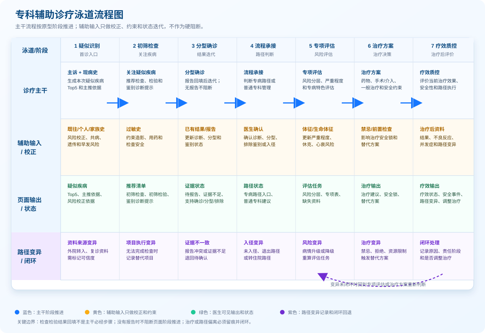

# 专科辅助诊疗 PRD

版本：V1.0  
更新日期：2026-08-26  
适用范围：心血管内科专科辅助诊疗。急性心肌梗死（AMI）和心肌病用于原型演示与样板验收，不代表系统只覆盖这两个病种；后续按同一结构扩展其他心血管专病。

## 1. 文档定位

本文档说明专科辅助诊疗产品的业务流程、页面展示、图谱数据要求和验收口径。阅读对象包括产品、设计、前端、后端、图谱建模、规则配置和临床审核人员。

专科辅助诊疗不是把疾病下所有检查、检验、药品、手术一次性展示给医生，而是围绕患者当前诊疗阶段回答四个问题：

1. 当前最可能的疑似疾病是什么，依据是什么。
2. 当前还缺哪些检查、检验或病史资料，分别服务于确诊、分型、鉴别还是治疗安全。
3. 鉴别诊断当前处于什么状态，是否影响治疗方案。
4. 是否进入专病路径；没有专病路径时如何输出普通专科治疗建议。

## 2. 产品目标

| 编号 | 目标 | 说明 |
| --- | --- | --- |
| OBJ-01 | 支持疑似疾病识别 | 主诉和现病史是疑似疾病召回和排序主轴；既往史、个人史、家族史、过敏史、体格检查和已有检查检验结果用于风险加权、病情分层、鉴别支持和治疗安全约束。 |
| OBJ-02 | 支持首诊资料补齐 | 医生关注或回写疑似疾病后，推荐首诊阶段需要补齐的检查和检验。 |
| OBJ-03 | 支持鉴别诊断管理 | 明确每个鉴别对象的状态、依据、缺失项目和治疗影响。 |
| OBJ-04 | 支持治疗安全判断 | 治疗建议必须读取鉴别状态、禁忌证、过敏史、治疗前置检查和检验结果。 |
| OBJ-05 | 支持专病路径承接 | 有专病路径的病种进入路径阶段管理；没有专病路径的病种仍按普通专科规则输出治疗建议。 |
| OBJ-06 | 支持证据追溯 | 推荐内容需要能追溯到规则来源、推荐来源、指南或教科书证据来源。 |

## 3. 用户角色与使用场景

角色边界：本表不是医院全部岗位清单，只列专科辅助诊疗产品直接使用、维护或质控的核心角色。护理、药师、医技等岗位当前作为数据来源、医嘱执行或协同环节接入，不进入本 PRD 的主诊疗角色；后续如果建设护理监测、药学审方或检查预约闭环，可再扩展独立角色。

产品边界：当前产品面向心血管内科专科疾病，覆盖门诊、急诊、住院、外院转入住院、出院后复诊和随访回院等连续诊疗场景。AMI 和心肌病是原型案例，不是适用范围上限。

| 角色 | 使用场景 | 关注点 |
| --- | --- | --- |
| 门急诊接诊医生 | 门诊首诊、急诊首诊、录入主诉、现病史、一诉五史和体格检查。 | 快速获得疑似疾病、初筛检查检验、高危鉴别提醒和急危重风险提示。 |
| 住院接诊/管床医生 | 本院门急诊转入住院、外院转入住院、院内转科、住院期间病情变化。 | 复核诊断和分型，承接外院检查检验、用药、手术/介入资料，判断是否进入住院临床路径或专病管理。 |
| 心血管专科医生/上级医师 | 确诊、分型、复杂高危病例会诊、治疗方案确认、路径变异处理。 | 判断证据是否足够，治疗是否安全，是否需要调整治疗、入径或退出路径。 |
| 出院与复诊随访医生 | 出院前评估、门诊离院、住院出院、出院后复诊、随访回院、再入院评估。 | 查看本次治疗效果、复查计划、随访任务、病情变化和是否需要重新进入诊疗流程。 |
| 临床审核/质控人员 | 审核推荐内容、规则、证据、路径执行和变异记录。 | 推荐是否符合指南、教科书、医院制度和国家/院内住院临床路径。 |
| 产品与研发人员 | 设计页面、接口、规则、图谱结构和数据契约。 | 图谱关系是否能支撑门急诊、住院、转入、出院复诊的业务闭环。 |

### 3.1 适用就诊场景边界

| 就诊场景 | 系统入口 | 主要处理 | 不应混淆的边界 |
| --- | --- | --- | --- |
| 门诊首诊 | 主诉、现病史、一诉五史和体格检查录入。 | 生成疑似疾病 Top5，推荐初筛检查检验和鉴别诊断提示。 | 不默认进入住院路径，不一次性铺开全部治疗和路径任务。 |
| 急诊首诊 | 急性症状、生命体征、急危重表现和既往风险录入。 | 优先识别高危疑似疾病、急危重鉴别、必须补齐的检查检验和治疗安全锁。 | 急诊可以提示住院或抢救承接，但不是住院路径已经启动。 |
| 本院门急诊转入住院 | 已有门急诊疑似疾病、检查检验、处置和医嘱承接。 | 进入住院接诊复核，判断诊断是否成立、资料是否足够、是否满足入径条件。 | 不把患者重新当作空白首诊；已有有效报告不重复推荐。 |
| 外院转入住院 | 外院诊断、检查检验报告、用药、手术/介入和出院/转诊记录导入。 | 先做资料承接和诊断复核，再判断缺失资料、鉴别状态、治疗安全和住院路径。 | 外院资料必须标明来源、时间和可信状态；过期、不完整或不可信资料才触发补查。 |
| 住院路径内 | 已确认住院诊断、分型和入径状态。 | 展示路径阶段任务、缺失项目、治疗安全、路径变异和疗效质控。 | 路径阶段任务不替代专科治疗安全判断；路径外问题仍走专科辅助诊疗。 |
| 出院前/门诊离院 | 当前治疗结束或本阶段诊疗完成。 | 输出疗效评估、风险复评、出院/离院医嘱、复查项目和随访计划。 | 随访是本阶段结束后的输出事项，不是当前治疗主干阶段。 |
| 复诊/随访回院 | 读取上次诊断、治疗方案、路径执行、疗效质控和随访计划。 | 判断病情稳定、恶化、复发、并发症、再入院或新发问题，并决定是否重新进入疑似识别或专项评估。 | 复诊不是简单复制首诊流程；先承接历史资料，再根据本次主诉和结果决定是否开启新一轮诊疗。 |

### 3.2 原型就诊场景下拉与流程状态边界

原型下拉只表达患者来源/入口，用于决定首屏默认读取哪些历史资料、是否承接外院资料、是否进入住院复核或随访复评。住院路径内、出院前/门诊离院属于系统运行后的流程状态，不是患者进入系统的入口，所以不放入下拉。

| PRD 场景 | 是否放入原型下拉 | 原型下拉值或归属 | 进入系统后的默认处理 | 边界说明 |
| --- | --- | --- | --- | --- |
| 门诊首诊 | 放入下拉 | 门诊首诊 | 进入疑似识别，按主诉和现病史生成疑似疾病 Top5。 | 不默认进入住院路径，不一次性铺开治疗和路径任务。 |
| 急诊首诊 | 放入下拉 | 急诊首诊 | 进入疑似识别，同时优先触发急危重、高危鉴别和必须补齐的检查检验。 | 可以提示抢救、住院或路径承接，但不能等同住院路径已启动。 |
| 本院门急诊转入住院 | 放入下拉 | 本院门急诊转入住院 | 先承接本院门急诊已产生的疑似疾病、检查检验、处置和医嘱，再做住院接诊复核。 | 不把患者重新当作空白首诊；已有有效报告不重复推荐。 |
| 外院转入住院 | 放入下拉 | 外院转入住院 | 先进入外院资料承接和诊断复核，标记资料来源、时间和可信状态。 | 外院资料不直接等同本院有效证据；不完整、不可信或过期时才触发补查。 |
| 出院后复诊/随访回院 | 放入下拉 | 出院后复诊/随访回院 | 先读取上次诊断、治疗方案、路径执行、疗效质控和随访计划，再判断是否稳定复查、病情变化或新发问题。 | 复诊不是简单复制首诊流程；只有出现新主诉、新结果或病情变化时才重新进入疑似识别。 |
| 住院路径内 | 不放入下拉 | 流程状态 | 由“流程承接/入径确认”后进入，展示路径阶段任务、缺失项目、治疗安全和路径变异。 | 这是入径后的管理状态，不是患者来源入口。 |
| 出院前/门诊离院 | 不放入下拉 | 流程状态 | 由治疗阶段完成或医生触发离院/出院动作后进入，输出疗效评估、复查项目和随访计划。 | 这是本阶段结束状态，不是入口；随访计划是输出事项。 |

## 4. 完整业务流程

专科辅助诊疗流程必须对应原型阶段条，主干流程描述医生和系统的诊疗推进状态；辅助分支描述随时影响主干判断的资料输入。检查检验结果回填不是主干必经步骤，没有报告时不阻断页面阶段推进，而是让相关诊断、鉴别或治疗保持“待报告、证据不足、需补齐、治疗安全锁”等状态。

### 4.1 主干流程（对应原型阶段条）

#### 主干与辅助分支泳道流程图

| 泳道 | 1 疑似识别 | 2 初筛检查 | 3 分型确诊 | 4 流程承接 | 5 专项评估 | 6 治疗方案 | 7 疗效质控 |
| --- | --- | --- | --- | --- | --- | --- | --- |
| 诊疗主干 | 主诉 + 现病史生成疑似疾病 Top5 | 关注疑似疾病后推荐检查、检验、鉴别提示 | 报告回填后迭代；无报告不阻断 | 判断专病路径或普通专科管理 | 触发风险、严重程度和专病特色评估 | 输出药物、手术/介入、一般治疗和治疗前安全约束 | 评价当前治疗效果、安全性和路径执行情况 |
| 辅助输入/校正 | 既往史、个人史、家族史、体格检查参与风险校正 | 过敏史约束造影、用药和检查安全 | 已有结果或报告回填更新诊断、分型和鉴别 | 医生确认推动阶段变化 | 体征、生命体征和结果回填更新风险分层 | 过敏史、禁忌证和前置检查约束治疗安全 | 治疗后检查检验、治疗后资料、不良反应和路径变异持续回填 |
| 页面输出/状态 | 疑似疾病、主推依据、风险校正依据 | 初筛检查推荐、初筛检验推荐、鉴别诊断提示 | 待报告、证据不足、支持确诊、支持分型、已排除 | 专病路径入口、普通专科建议、入径原因 | 风险分层、专项评估表、缺失资料 | 治疗建议、安全锁、替代方案 | 疗效状态、治疗安全、路径变异、是否调整治疗；随访计划作为治疗结束或离院输出 |
| 路径变异/闭环 | 外院转入、复诊资料需标记可信度 | 无法完成检查时记录替代项目 | 报告冲突或证据不足时退回待确认 | 未入径、退出路径或转住院路径时记录原因 | 病情升级或降级后重算评估任务 | 禁忌、拒绝或资源限制触发替代方案 | 记录原因、责任阶段和是否调整治疗；未闭环时回到专项评估或治疗方案 |

| 原型阶段 | 触发动作 | 系统处理 | 页面输出 | 状态边界 |
| --- | --- | --- | --- | --- |
| 疑似识别 | 医生录入主诉和现病史。 | 召回并排序本次就诊疑似疾病 Top5。 | 疑似疾病、主推依据、风险校正依据。 | 主诉和现病史是入口；既往史、个人史、家族史、过敏史、体格检查作为辅助分支参与校正。 |
| 初筛检查 | 医生关注或回写某个疑似疾病。 | 查询该疑似疾病的首诊检查、首诊检验和鉴别诊断任务。 | 初筛检查推荐、初筛检验推荐、鉴别诊断提示。 | 检查检验结果未回填时仍可展示推荐清单；项目状态显示待报告或需补齐。 |
| 分型确诊 | 医生查看已有结果，或检查检验报告回填触发迭代分析。 | 读取诊断标准、检查发现、检验细项、分型依据和鉴别依据。 | 分型辅助诊断、确诊支持/排除依据、鉴别状态。 | 报告回填是事件分支；没有结果时不强制阻断主干，只保持待报告或证据不足。 |
| 流程承接 | 医生确认疑似疾病、具体诊断或分型方向。 | 判断是否存在专病路径、是否满足入径提示条件。 | 专病路径入口、路径阶段提示；无路径时提示普通专科管理。 | 专病路径不是治疗唯一来源；无路径不影响普通治疗建议生成。 |
| 专项评估 | 疾病、分型、治疗方向或路径阶段需要进一步评估。 | 查询风险分层、严重程度、并发症、治疗前安全、专病特色评估。 | 风险评估、专项检查、缺失资料和安全提示。 | 专项评估可被报告回填、体格检查、既往史和治疗方案共同触发。 |
| 治疗方案 | 分型/确诊依据成立，或医生确认进入治疗决策。 | 读取适应证、禁忌证、过敏史、鉴别状态、前置检查检验和证据来源。 | 药物、手术/介入、一般治疗、治疗前安全约束。 | 高危鉴别未排除或安全资料缺失时，治疗建议可展示但必须标记安全锁或条件限制。 |
| 疗效质控 | 医生执行药物、非药物、介入、手术或路径内治疗后。 | 查询疗效指标、安全指标、不良反应、并发症、路径执行和路径变异。 | 疗效状态、治疗安全、路径变异、是否调整治疗；离院或复诊前生成随访计划。 | 覆盖手术和非手术两类治疗；随访是治疗结束后的输出事项，不作为当前治疗主干阶段。 |

### 4.2 辅助分支

| 辅助分支 | 触发时机 | 对主干流程的影响 | 不应承担的职责 |
| --- | --- | --- | --- |
| 既往史分支 | 首诊录入时或病历同步时。 | 区分既往疾病、共病、复发风险和治疗注意事项；影响疑似疾病风险加权和治疗安全。 | 不单独生成当前就诊疑似疾病，不把既往高血压、糖尿病等直接写成当前诊断。 |
| 个人史分支 | 首诊录入时或健康档案同步时。 | 识别吸烟、饮酒、职业暴露等长期风险，影响风险评估、宣教和随访。 | 不单独作为本次疾病确诊依据。 |
| 家族史分支 | 首诊录入时或专病评估时。 | 识别早发冠心病、心肌病、猝死等遗传和早发风险；可触发家系筛查。 | 不脱离主诉、现病史和检查证据直接确诊遗传性疾病。 |
| 过敏史分支 | 首诊录入、开检查、开药、介入治疗前。 | 约束药物、造影、检查和治疗安全，触发禁忌或替代方案。 | 不参与疑似疾病排序。 |
| 体格检查/生命体征分支 | 首诊录入、病情变化、护理采集或设备同步时。 | 判断严重程度、休克、心衰、急危重、鉴别支持或排除。 | 不替代主诉和现病史，但异常生命体征可触发高危提醒。 |
| 检查检验结果回填分支 | 医生回填报告、接口同步报告、历史报告导入时。 | 迭代更新诊断标准、分型、鉴别状态、风险分层和治疗安全锁。 | 检查检验结果回填不是主干必经步骤；没有结果时不阻断页面阶段推进。 |
| 医生确认分支 | 医生关注疾病、确认诊断、确认分型、排除鉴别或选择治疗时。 | 推动流程从推荐状态进入确认状态。 | 系统不能替代医生确认最终诊断和治疗决策。 |

### 4.3 分阶段查询模型

专科辅助诊疗必须符合医生病历书写顺序和门急诊真实工作流。第一次看病时，系统先根据主诉和现病史先生成疑似疾病；医生关注疑似疾病后，再推荐需要开单的检查和检验；检查检验结果回填后再进入迭代分析，更新诊断、鉴别、分型、治疗安全和路径。

| 阶段 | 触发条件 | 本阶段允许查询的图谱关系 | 本阶段禁止查询或禁止展示 | 输出结果 |
| --- | --- | --- | --- | --- |
| P0 首诊录入阶段 | 医生录入主诉和现病史，可能同时录入既往史、个人史、家族史、过敏史、体格检查。 | 疾病—主诉关键词、疾病—症状、疾病—现病史特征、疾病—急危重特征；既往史/个人史/家族史只读危险因素和风险加权关系；体格检查只读严重程度和高危提示关系。 | 禁止在首诊录入阶段一次性查询疾病下所有检查、检验、治疗、路径关系；禁止直接输出治疗方案。 | 疑似疾病 Top5、主推依据、风险校正依据、高危提醒。 |
| P1 关注疑似疾病阶段 | 医生点击关注或回写某个疑似疾病。 | 该疑似疾病下的初筛检查、初筛检验、鉴别诊断、关键缺失资料关系。 | 不查询无关疾病的全部推荐项目；治疗方案只显示“需满足前置条件”，不作为可执行医嘱。 | 初筛检查推荐、初筛检验推荐、鉴别诊断提示。 |
| P2 报告回填或已有结果阶段 | 本次检查、检验、影像、病理报告回填，或系统读取到已有可用结果。 | 检查发现、检验细项、诊断标准、鉴别支持/排除依据、分型依据、风险分层关系。 | 不重复推荐已有结果；证据不足时不自动确诊或排除。 | 更新鉴别状态、分型辅助诊断、风险分层、缺失项目提醒。 |
| P3 分型确诊阶段 | 医生确认诊断、分型或关键鉴别已排除。 | 治疗方案、治疗前安全、禁忌证、药品、手术/介入、专病路径、质控表单、随访关系。 | 高危鉴别未排除或前置检查缺失时，不直接放开高风险治疗建议。 | 治疗方案、治疗安全锁、专病路径入口、随访计划。 |

开发接口应按阶段查询，不能把 Disease 节点下所有实体关系一次性返回给前端。前端展示也应按阶段分区，避免医生在首诊录入阶段看到未被当前诊疗动作触发的检查、检验、治疗或路径内容。

### 4.4 专科诊疗路径与住院临床路径边界

专科诊疗路径是专科 CDSS 的诊疗决策链路，覆盖门诊、急诊和住院；国家版/院内住院临床路径是住院场景下的标准执行链路。两者不能混成一个路径对象，应在“流程承接”阶段建立关联，在“专项评估、治疗方案、疗效质控”阶段协同使用。

专科诊疗路径不是替代国家版或院内住院临床路径，而是国家路径启动前的专科决策入口、路径执行中的安全与证据补充、路径外/路径变异场景下的诊疗承接能力。重点价值体现在疑似阶段、复杂高危病例、合并症多病例、无法入径或发生路径变异的病例。

住院衔接口径：本院门急诊转入住院时，系统应承接门急诊阶段已经生成的疑似疾病、检查检验、处置和医嘱，不重复把患者当作空白首诊。外院转入住院时，系统应先进入“资料承接与诊断复核”状态，读取外院诊断、报告、用药、手术/介入和转诊记录，再判断缺失资料、鉴别状态、治疗安全和是否可入径。住院后复诊或出院后随访回院时，系统应先读取上次住院诊断、路径执行、治疗方案、疗效质控和随访计划，再判断是稳定复查、病情变化、复发/并发症、再入院，还是新的就诊问题。

如果 Markdown 预览器未显示 SVG，可直接打开：[专科诊疗路径与住院临床路径对比图.svg](./专科诊疗路径与住院临床路径对比图.svg)。

| 对比维度 | 专科诊疗路径 | 国家版/院内住院临床路径 | 结合方式与产品落点 |
| --- | --- | --- | --- |
| 定位 | 支撑疑似识别、检查检验推荐、鉴别诊断、分型、治疗决策。 | 规范住院病人的标准诊疗执行、质控和变异管理。 | 专科诊疗路径先判断疾病和治疗方向；住院临床路径在符合入径条件后承接执行。 |
| 适用场景 | 门诊、急诊、住院均可使用。 | 主要用于住院患者。 | 门急诊阶段只提示“可能符合住院路径”；住院后才进入路径阶段任务。 |
| 启动时机 | 主诉和现病史录入后即可启动疑似识别。 | 诊断或分型基本明确，并满足住院和入径条件后启动。 | “分型确诊”后判断是否具备入径条件，“流程承接”展示可入径或不入径原因。 |
| 核心对象 | 疾病、症状、体征、检查、检验、鉴别、分型、治疗方案、证据。 | 临床路径、路径阶段、路径任务、入径条件、退出条件、变异原因、出院标准。 | 图谱中保留两个对象层级：`SpecialtyCareFlow` 和 `InpatientClinicalPathway`。 |
| 治疗方案 | 根据诊断、分型、鉴别状态、禁忌证和证据生成治疗建议。 | 根据路径阶段提供标准住院诊疗任务。 | 已入径时优先显示路径阶段任务，同时保留专科治疗安全锁；未入径时显示普通专科治疗建议。 |
| 路径变异 | 影响诊疗推荐、安全锁和是否调整治疗。 | 记录偏离路径的原因、责任阶段和质控结果。 | 变异提醒出现在专项评估和治疗方案；变异闭环进入疗效质控和质控统计。 |
| 疗效质控 | 评价本次治疗效果、安全性、是否需要调整治疗。 | 评价路径任务完成度、变异、出院标准和质控指标。 | 同一患者可以同时展示“治疗疗效”和“路径执行情况”，但两者指标来源和业务含义分开。 |
| 随访 | 治疗结束、门诊离院、住院出院或路径阶段结束后生成后续事项。 | 出院医嘱、复诊复查、康复、宣教和长期管理计划。 | 随访作为治疗结束后的输出，不作为当前治疗主干阶段；可由疗效质控、出院标准或路径阶段触发。 |

完整产品链应按以下顺序落地：

| 产品链环节 | 主要判断 | 使用专科诊疗路径 | 使用住院临床路径 | 页面输出 |
| --- | --- | --- | --- | --- |
| 首诊疑似识别 | 本次最可能是什么病。 | 是 | 否 | 疑似疾病 Top5、主推依据、风险校正依据。 |
| 关注疑似疾病 | 当前应补哪些检查检验，需排除哪些鉴别。 | 是 | 否 | 初筛检查、初筛检验、鉴别诊断提示。 |
| 分型确诊 | 证据是否支持确诊、分型或排除鉴别。 | 是 | 否 | 诊断标准、分型依据、鉴别状态。 |
| 住院接诊/外院转入 | 已有资料是否可信、完整，是否需要补查和复核。 | 是 | 判断是否可进入 | 外院资料承接、诊断复核、补查清单、入径条件判断。 |
| 流程承接 | 是否存在专病路径或住院临床路径。 | 是 | 判断是否可进入 | 专病路径入口、住院路径入口、入径/不入径原因。 |
| 路径阶段执行 | 已入径患者当前该做什么。 | 辅助安全判断 | 是 | 路径阶段、阶段任务、缺失项目、变异预警。 |
| 治疗方案 | 当前治疗建议是否可执行、安全。 | 是 | 已入径时提供阶段任务 | 治疗建议、安全锁、替代方案、路径内治疗任务。 |
| 疗效质控 | 当前治疗是否有效、安全，路径是否偏离。 | 是 | 是 | 疗效状态、安全事件、路径变异、是否调整治疗。 |
| 出院/离院输出 | 当前阶段结束后如何复查和管理。 | 是 | 是 | 出院/离院医嘱、复查项目、宣教、预警事项和随访计划。 |
| 复诊/随访回院 | 上次治疗后是否稳定，是否出现复发、并发症或新问题。 | 是 | 读取历史路径结果 | 随访完成状态、疗效复评、是否进入新一轮疑似识别或专项评估。 |

## 5. 疑似疾病推导边界与输入职责

| 输入内容 | 是否作为当前就诊疑似疾病主推依据 | 产品职责 | 开发实现边界 | 主要图谱查询方向 |
| --- | --- | --- | --- | --- |
| 主诉 | 是 | 识别当前就诊主题，例如胸痛、胸闷、心悸、晕厥，用于召回疑似疾病候选。 | 主诉只能回答“当前就诊主要问题是什么”，不能单独等同确诊。 | 疾病—症状、疾病—主诉关键词、症状别名。 |
| 现病史 | 是 | 读取起病时间、持续时间、疼痛性质、放射痛、伴随症状和急危重特征，用于疑似疾病排序。 | 现病史与主诉共同形成本次就诊疑似疾病 Top5，是首诊推荐入口。 | 疾病—病史特征、疾病—时间窗、疾病—伴随症状、疾病—急危重特征。 |
| 既往史 | 否 | 识别高血压、糖尿病、冠心病、心衰等风险背景、共病和既往疾病。 | 既往史不单独作为当前就诊疑似疾病主推依据；用于区分“既往已患疾病”和“当前就诊疑似疾病”，并影响风险分层、鉴别方向和治疗注意事项。 | 疾病—危险因素、疾病—共病、治疗—注意事项。 |
| 个人史 | 否 | 识别吸烟、饮酒、职业暴露、生活方式等长期风险。 | 个人史只做风险加权、长期管理和宣教输入，不直接生成当前诊断。 | 疾病—危险因素、疾病—流行病学因素、随访/宣教关系。 |
| 家族史 | 否，特殊遗传性疾病可强化候选 | 识别早发冠心病、心肌病、猝死等遗传和早发风险。 | 家族史用于提高心肌病、遗传性疾病等候选权重，并触发家系筛查提示；不能替代主诉和现病史。 | 疾病—遗传风险、疾病—家族史、风险分层—高危因素。 |
| 过敏史 | 否 | 约束药物、造影和介入治疗安全。 | 过敏史不参与疑似疾病排序；只影响检查选择、用药禁忌、治疗安全锁和替代方案。 | 药物—禁忌证、检查—禁忌证、治疗方案—治疗前安全。 |
| 体格检查 | 支持/校正，不作为主轴 | 支持病情严重程度、心衰评估、休克识别和鉴别诊断。 | 体格检查用于校正疑似疾病排序、判断病情程度和鉴别支持/排除；异常生命体征可触发急危重提醒。 | 疾病—体征、生命体征—风险阈值、鉴别诊断—支持/排除依据。 |
| 已有检查检验结果 | 支持/校正，可进入确诊或分型 | 读取当前就诊记录中已有报告，避免重复推荐，并推动确诊、分型、风险分层和鉴别状态更新。 | 已有结果不属于一诉五史，但会直接改变推荐阶段；例如心电图 ST 段抬高会推动 AMI 分型判断。 | 疾病—检查发现、疾病—检验细项、诊断标准—支持/排除依据。 |

## 6. 功能需求清单

| 编号 | 功能 | 产品要求 | 图谱支撑要求 |
| --- | --- | --- | --- |
| FR-01 | 疑似疾病推荐 | 以主诉和现病史生成本次就诊疑似疾病候选，并展示命中依据。既往史、个人史、家族史、过敏史、体格检查和已有结果用于校正排序、补充风险和约束后续推荐。 | 疾病与主诉关键词、现病史特征、症状、体征、危险因素、检查检验异常建立可查询关系；需要区分“主推依据”和“校正/约束依据”。 |
| FR-02 | 初筛检查推荐 | 按检查项目输出首诊阶段需要补齐的检查。 | 每条检查推荐必须标明临床用途、服务对象、优先级、规则来源和证据来源。 |
| FR-03 | 初筛检验推荐 | 按检验项目输出首诊阶段需要补齐的检验。 | 每条检验推荐必须标明临床用途、服务对象、优先级、规则来源和证据来源。 |
| FR-04 | 鉴别诊断提示 | 展示当前疑似疾病需要鉴别的疾病或高危情况，并说明需要哪些检查检验支持排除或命中。 | 鉴别对象必须有关联依据、所需检查检验、状态和治疗影响。 |
| FR-05 | 鉴别状态管理 | 支持待排、已排除、鉴别命中、证据不足四种状态。 | 图谱关系需要表达支持依据、排除依据、缺失依据和安全影响。 |
| FR-06 | 分型辅助诊断 | 检查检验结果回填后，辅助判断疾病分型或具体诊断。 | 疾病、分型、检查发现、检验细项和诊断标准需要建立关系。 |
| FR-07 | 治疗方案推荐 | 在证据和安全条件满足后输出治疗建议。 | 治疗方案需要关联适应证、禁忌证、前置检查检验、用药、手术/介入和证据。 |
| FR-08 | 治疗安全锁 | 高危鉴别未排除、禁忌证未确认、关键前置项目缺失时阻断或提示治疗风险。 | 治疗方案与高危鉴别、禁忌证、过敏史、肾功能、凝血功能等建立安全关系。 |
| FR-09 | 专病路径承接 | 已确认病种具备专病路径时，提示进入路径阶段管理。 | 疾病或分型需要关联专病路径、路径阶段、阶段任务、质控表单和随访任务。 |
| FR-10 | 知识追溯 | 展开详情可查看推荐来源、规则来源和证据来源。 | 规则、推荐动作、证据原文、指南/教科书来源需要可追溯。 |

## 6.1 开发读取规则

| 场景 | 读取优先级 | 输出要求 |
| --- | --- | --- |
| P0 首诊录入阶段：生成疑似疾病 Top5 | 主诉、现病史优先；体格检查和已有检查检验结果参与校正；既往史、个人史、家族史参与风险加权。 | 输出候选疾病、主推依据、校正依据，不把既往疾病直接写成当前就诊疑似疾病。 |
| P1 关注疑似疾病阶段：推荐初筛检查/检验 | 医生关注或回写疑似疾病后触发，只查询该疑似疾病的首诊任务。 | 按检查和检验分组，项目摘要必须说明确诊/分型、鉴别排除、高危鉴别、治疗前安全或风险分层用途。 |
| P2 报告回填或已有结果阶段：更新鉴别和分型 | 检查检验结果、体格检查和病史特征共同判断。 | 输出待排、已排除、鉴别命中、证据不足、分型辅助诊断和缺失项目。 |
| P3 分型确诊阶段：输出治疗和路径 | 分型或确诊依据成立后触发。 | 读取鉴别状态、过敏史、禁忌证、肾功能、凝血功能、专病路径等治疗安全信息。 |

## 7. 初筛检查与初筛检验展示规则

初筛检查推荐和初筛检验推荐是首诊阶段的资料补齐清单，不等于每个项目都只用于确诊。一个项目可以服务于确诊、分型、鉴别排除、高危鉴别、治疗前安全或风险分层。

页面采用“项目名称 + 临床摘要”的列表方式。默认列表使用完整短标签；展开详情只展示当前状态、临床依据、推荐来源、规则来源和证据来源。医生端不展示图谱字段，字段编码、关系类型、解析批次、审核状态等技术信息只用于接口、后台维护和质控追溯。

完整短标签用于右侧小助手默认展示，避免占用过多空间：`缺结果` 表示当前就诊尚未获取或回填该项目结果；`已有结果` 表示结果已进入当前诊疗判断；`待报告` 表示已开立或已申请但报告未回；`治疗前补充` 表示治疗或路径动作前必须补齐；`证据不足` 表示已有信息不足以支持确认或排除。

专科检查与辅助检查/检验必须分开：专科检查记录心音、杂音、颈静脉怒张、下肢水肿、心前区体征等医生查体内容；心电图、肌钙蛋白、CK-MB、BNP/NT-proBNP、超声心动图、CTA、肾功能、凝血功能等必须归入辅助检查/检验结果。

| 临床用途 | 示例 | 列表态摘要 | 展开态需要说明 |
| --- | --- | --- | --- |
| 确诊/分型 | 心电图、心肌肌钙蛋白 | 确诊/分型｜缺结果 | 服务 AMI 诊断和 STEMI/NSTEMI 分型。 |
| 鉴别排除 | 肺动脉 CTA | 鉴别排除｜肺栓塞待排 | 服务肺栓塞鉴别，结果会影响后续诊断判断。 |
| 高危鉴别 | 主动脉 CTA | 高危鉴别｜主动脉夹层待排 | 服务主动脉夹层鉴别，未排除时影响溶栓和强抗栓安全。 |
| 治疗前安全 | 血肌酐、凝血功能、血常规 | 治疗前安全｜治疗前补充 | 服务造影、PCI、抗凝和抗血小板治疗安全。 |
| 风险分层 | 超声心动图、BNP/NT-proBNP | 风险评估｜心功能评估 | 服务心衰、容量负荷和预后风险判断。 |

## 8. 鉴别诊断状态规则

| 状态 | 页面表现 | 业务处理 | 治疗影响 |
| --- | --- | --- | --- |
| 待排 | 保留在鉴别诊断提示中，必要时高亮。 | 推荐补齐排除所需检查或检验。 | 相关高风险治疗保持安全锁。 |
| 已排除 | 弱化显示，保留排除依据。 | 不再作为当前主要待排对象。 | 解除对应治疗安全锁。 |
| 鉴别命中 | 置顶显示，并提示医生确认。 | 转为新的诊断候选或并发问题处理。 | 阻断或调整原治疗方案。 |
| 证据不足 | 显示缺失依据。 | 推荐补齐关键检查、检验或病史资料。 | 不自动排除，也不自动确认。 |

## 9. 治疗方案与专病路径边界

| 场景 | 产品行为 | 业务边界 |
| --- | --- | --- |
| 疑似疾病阶段 | 以补齐检查检验和鉴别诊断为主。 | 不直接输出可执行治疗方案。 |
| 分型或确诊依据成立 | 输出普通专科治疗建议。 | 需要读取鉴别状态、禁忌证、过敏史和治疗前置资料。 |
| 存在专病路径 | 提示进入路径阶段管理。 | 路径负责流程承接、阶段任务、治疗质控和随访输出，不替代医生决策。 |
| 不存在专病路径 | 继续输出普通专科治疗建议。 | 不强制入径，不隐藏普通治疗建议。 |
| 路径内治疗建议 | 叠加路径阶段任务。 | 路径阶段不能绕过治疗安全锁。 |

## 10. 图谱数据契约（研发/后台使用）

图谱推荐关系需要表达“诊疗任务—推荐动作—服务对象—当前状态—后续影响”。仅有“疾病关联检查/检验”的泛化关系不足以支撑专科辅助诊疗。

本节是研发、接口和后台维护使用的数据契约，不是医生端展示内容。医生端只消费这些字段计算后的临床摘要、证据来源和推荐依据，不直接展示字段名或关系名。

| 字段或关系 | 必填 | 产品用途 |
| --- | --- | --- |
| clinical_stage | 是 | 判断首诊、鉴别、治疗前、路径内、随访等阶段。 |
| purpose | 是 | 判断确诊/分型、鉴别排除、高危鉴别、治疗前安全、风险分层等用途。 |
| service_target_type | 是 | 判断服务对象类型：疾病、疾病分型、鉴别诊断、治疗方案、路径阶段。 |
| service_target_name | 是 | 展示具体服务对象，例如 AMI、STEMI 分型、主动脉夹层、PCI。 |
| result_status | 是 | 表达缺结果、已有结果、待报告、治疗前补充、已开立、无需重复推荐等短状态；完整解释放在展开详情或接口字典。 |
| differential_status | 鉴别场景必填 | 表达待排、已排除、鉴别命中、证据不足。 |
| safety_impact | 治疗相关必填 | 表达维持安全锁、解除安全锁、阻断治疗、强提醒。 |
| recommendation_source | 是 | 说明推荐来自指南、教科书、专病路径、院内审核配置或医生确认资料。 |
| rule_source | 是 | 说明触发推荐的具名业务规则。 |
| evidence_source | 正式推荐必填 | 追溯到指南原文、教科书章节、证据摘要或院内规则。 |

## 11. 当前模拟病种要求

### 11.1 急性心肌梗死（AMI）

| 模块 | 要求 |
| --- | --- |
| 疑似疾病 | 胸痛、放射痛、出汗、恶心呕吐、高血压、糖尿病、吸烟、家族史等支持 AMI 风险判断。 |
| 初筛检查 | 心电图用于确诊/分型；超声心动图用于风险评估；主动脉 CTA 用于高危鉴别；肺动脉 CTA 用于肺栓塞鉴别。 |
| 初筛检验 | 心肌肌钙蛋白、肌酸激酶同工酶、BNP/NT-proBNP、血常规、凝血功能、肾功能等需区分确诊/分型、风险评估和治疗前安全。 |
| 鉴别诊断 | 主动脉夹层、肺栓塞、急性心包炎等必须有状态和所需检查检验。 |
| 治疗方案 | 再灌注、PCI、抗血小板、抗凝、调脂等建议必须读取鉴别状态和治疗前安全项目。 |
| 专病路径 | 确认 AMI 或具体分型后可提示进入 AMI 专病流程。 |

### 11.2 心肌病

| 模块 | 要求 |
| --- | --- |
| 疑似疾病 | 心悸、胸闷、呼吸困难、晕厥、心衰表现、家族史、猝死风险等支持心肌病疑似判断。 |
| 初筛检查 | 心电图、超声心动图、心脏磁共振、动态心电图等按确诊/分型、风险评估、鉴别排除区分用途。 |
| 初筛检验 | BNP/NT-proBNP、心肌损伤标志物、肝肾功能、电解质等服务心功能评估和治疗安全。 |
| 专病特色 | 肥厚型心肌病、扩张型心肌病、限制型心肌病、致心律失常性心肌病等分型需要保留差异化结构；涉及遗传、家系筛查、病理检查时，按专病特色节点和证据关系扩展。 |
| 治疗方案 | 药物治疗、器械治疗、介入/手术评估、遗传咨询和随访管理需根据分型、风险分层和禁忌证生成。 |

## 12. 完整业务流程案例说明

本节必须和原型图阶段条一一对应。每个阶段都要说明：医生录入了什么、医生点了什么或确认了什么、系统按什么关系查询、页面输出什么、医生下一步如何执行和记录。

### 12.1 急性心肌梗死（AMI）完整流程案例

| 原型阶段 | 患者资料/医生录入 | 具体交互动作 | 系统查询与判断 | 页面输出 | 医生执行与记录 |
| --- | --- | --- | --- | --- | --- |
| 疑似识别 | **主诉：**胸痛 2 小时。**现病史：**突发胸骨后压榨样疼痛，休息不能缓解，伴大汗、恶心呕吐、左肩放射痛。**补充病史/体格检查：**既往高血压、2 型糖尿病；长期吸烟；父亲 50 岁心梗；无阿司匹林和造影剂过敏；血压 160/95mmHg、心率 98 次/分。 | 医生完成主诉和现病史录入，点击“生成疑似疾病”或系统实时生成。 | 以主诉和现病史召回疑似疾病；用既往史、个人史、家族史、过敏史和体格检查做风险校正，不把补充病史/体格检查直接当确诊依据。 | 疑似疾病 Top5：急性心肌梗死、主动脉夹层、肺栓塞、急性心包炎、心绞痛等；展示 AMI 主推依据、风险校正依据和高危提醒。 | 医生关注“急性心肌梗死”，此时仍是疑似疾病，不等同确诊。 |
| 初筛检查/检验 | **就诊资料状态：**尚未获取或回填心电图、肌钙蛋白、CK-MB、肾功能、凝血功能、血常规等辅助检查/检验结果。 | 医生点击或回写“急性心肌梗死”后，右侧推荐区刷新。 | 查询 AMI 首诊任务；按用途区分确诊/分型、鉴别排除、治疗前安全和风险评估。 | **初筛检查推荐：**心电图、超声心动图；高危鉴别需要时显示主动脉 CTA、肺动脉 CTA。**初筛检验推荐：**肌钙蛋白、CK-MB、BNP/NT-proBNP、肾功能、凝血功能、血常规等。**鉴别诊断提示：**主动脉夹层、肺栓塞、急性心包炎等均为“待排”。 | 医生按临床需要开立心电图和心肌损伤标志物；若有撕裂样胸痛、脉搏差、低氧等提示，再开立对应 CTA 或其他鉴别检查。 |
| 分型确诊 | **辅助检查/检验结果：**心电图提示 ST 段抬高；肌钙蛋白升高；肾功能和凝血功能已回填；若已完成 CTA 且阴性，则主动脉夹层或肺栓塞可被支持排除。 | 医生点击“回填报告”或系统接收检查检验接口结果后，点击“重新生成推荐”。 | 读取诊断标准、检查发现、检验细项、分型依据和鉴别规则；更新 AMI、STEMI/NSTEMI 和鉴别诊断状态。 | **分型辅助诊断：**显示 STEMI 依据。**鉴别诊断状态：**显示“待排/已排除/证据不足/鉴别命中”。**缺失资料：**继续提示补齐。 | 医生确认 STEMI 或继续等待缺失报告；对已排除的鉴别记录排除依据，对证据不足的鉴别决定是否补查。 |
| 流程承接 | 医生已确认 AMI/STEMI 方向，患者可能需急诊 PCI 或转入住院。 | 医生点击“进入专病流程”或选择“普通专科管理/住院路径承接”。 | 判断是否存在 AMI 专科诊疗路径、是否满足住院临床路径入径条件、是否存在高危鉴别未排除或安全资料缺失。 | 显示专病路径入口、住院临床路径入口、入径条件、不入径原因和当前阶段任务。 | 医生选择入径、暂缓入径或普通专科管理；如果暂缓，必须选择原因，例如“鉴别未排除”“资料不全”“病情不符合路径”。 |
| 专项评估 | 进入再灌注/PCI 前评估或高危胸痛评估。 | 医生打开 PCI 前安全评估、风险分层或路径阶段任务。 | 查询治疗前安全、禁忌证、过敏史、肾功能、凝血功能、出血风险、造影剂风险、主动脉夹层排除状态。 | 展示 PCI 前安全锁、再灌注时间窗、风险分层、缺失资料和必须补齐项。 | 医生补齐必要资料；若安全条件不满足，记录暂缓原因或选择替代方案。 |
| 治疗方案 | STEMI 证据成立，高危鉴别已排除或被医生明确处理，治疗安全资料已满足或有替代策略。 | 医生进入“治疗方案”阶段并选择拟执行方案。 | 查询适应证、禁忌证、治疗前置检查检验、药物、介入/手术、一般治疗、证据来源和路径阶段任务。 | 输出再灌注/PCI、抗血小板、抗凝、调脂、镇痛、氧疗等建议；对禁忌或资料缺失项目显示安全锁和替代方案。 | 医生确认或调整治疗方案；系统记录采纳、拒绝、修改原因和证据引用。 |
| 疗效质控 | PCI、溶栓、药物或路径内治疗已经执行；回填术后/治疗后结果。 | 医生点击“疗效质控”或路径阶段任务完成。 | 查询再灌注效果、心电图变化、症状缓解、心肌标志物趋势、出血风险、心衰/心律失常并发症、路径执行和路径变异。 | 展示疗效状态、治疗安全、并发症预警、路径变异、是否调整治疗；离院或出院前生成随访计划。 | 医生记录治疗结果、并发症、路径变异和后续计划；若需调整治疗，进入新一轮专项评估或治疗方案。 |

### 12.2 心肌病完整流程案例

| 原型阶段 | 患者资料/医生录入 | 具体交互动作 | 系统查询与判断 | 页面输出 | 医生执行与记录 |
| --- | --- | --- | --- | --- | --- |
| 疑似识别 | **主诉：**胸闷、心悸、活动后气促 3 个月。**现病史：**上楼或运动后加重，休息可缓解，偶有黑矇或晕厥。**补充病史/体格检查：**家族中有猝死或心肌病史；体格检查可见杂音、心率异常或水肿。 | 医生完成主诉和现病史录入，点击“生成疑似疾病”或系统实时生成。 | 以胸闷、心悸、活动后气促、晕厥等召回心肌病、心衰、心律失常、冠心病等候选；家族史和体征只做风险强化与高危提示。 | 疑似疾病 Top5 中展示心肌病及相关鉴别疾病；展示“家族史/晕厥提示高危”的风险校正依据。 | 医生关注“心肌病”，此时只进入心肌病疑似方向，不直接确认具体分型。 |
| 初筛检查/检验 | **就诊资料状态：**尚未获取或回填心电图、超声心动图、动态心电图、BNP/NT-proBNP、肝肾功能、电解质等辅助检查/检验结果。 | 医生点击或回写“心肌病”后，右侧推荐区刷新。 | 查询心肌病首诊评估任务；按确诊/分型、风险评估、鉴别排除和治疗安全区分项目用途。 | **初筛检查推荐：**心电图、超声心动图、动态心电图、心脏磁共振等。**初筛检验推荐：**BNP/NT-proBNP、心肌损伤标志物、肝肾功能、电解质等。**鉴别诊断提示：**缺血性心脏病、心肌炎、瓣膜病、甲状腺相关心脏问题等。 | 医生开立基础检查检验；对家族史、晕厥或恶性心律失常风险明显者，优先补动态心电图和风险评估。 |
| 分型确诊 | **辅助检查/检验结果：**超声提示室壁肥厚或心腔扩大，动态心电图提示室性心律失常，心脏磁共振提示心肌组织学特征；部分报告仍可能缺失。 | 医生点击“回填报告”或系统接收报告后，点击“重新生成推荐”。 | 读取检查发现、影像表现、检验细项、诊断标准、分型依据和鉴别依据。 | **分型方向：**肥厚型、扩张型、限制型、致心律失常性心肌病等。**证据状态：**显示支持依据、缺失依据和需要排除的鉴别。 | 医生确认具体分型或继续补查；如果证据不足，保持“心肌病疑似/待分型”状态。 |
| 流程承接 | 医生确认心肌病或某一分型方向；患者可能为门诊管理、住院评估或外院转入。 | 医生选择“进入专病流程”“住院路径承接”或“普通专科管理”。 | 判断是否存在心肌病专科诊疗路径、具体分型路径或住院临床路径；读取入径条件、不入径原因和阶段任务。 | 显示路径入口、普通专科管理入口、入径条件和不入径原因。 | 医生选择路径或普通管理；无路径时继续输出普通专科治疗建议，不停止推荐。 |
| 专项评估 | 疑似遗传性、浸润性、炎症性、高危猝死风险或特殊分型。 | 医生打开“专项评估”或系统根据分型/高危因素触发。 | 查询遗传检测、家系筛查、心内膜心肌活检及病理检查、特殊代谢/酶学检查、风险分层和专病特色证据。 | 展示遗传咨询、家系筛查、病理检查、法布雷病等特殊疾病评估、猝死风险分层和缺失资料。 | 医生根据临床适应证选择检查；不满足适应证的项目不强推，只保留为专病特色评估候选。 |
| 治疗方案 | 分型、风险分层、心功能和禁忌证逐步明确。 | 医生进入“治疗方案”阶段并选择拟执行方案。 | 查询药物治疗、器械治疗、介入/手术评估、一般治疗、禁忌证、治疗前安全和证据来源。 | 输出心衰药物、心率控制、抗心律失常、ICD/CRT 评估、室间隔减容评估、遗传咨询、康复和宣教等建议，并显示安全约束。 | 医生采纳、修改或拒绝推荐；系统记录原因、治疗目标和证据来源。 |
| 疗效质控 | 药物、非药物、器械、介入或手术治疗已经执行；复查结果或随访资料回填。 | 医生点击“疗效质控”或复诊时触发疗效复评。 | 查询症状变化、心功能、LVEF、LVOT 压差、BNP/NT-proBNP、心律失常负荷、药物不良反应、器械/介入术后状态。 | 展示疗效状态、风险复评、治疗安全、是否调整治疗；离院、出院或复诊前生成随访计划。 | 医生记录疗效、调整方案、复查项目和随访时间；如病情变化明显，重新进入专项评估或疑似识别。 |

### 12.3 专科诊疗路径变异处理规则

路径变异闭环不是简单提示“偏离路径”，而是一个需要医生确认、系统记录、质控可追溯的闭环。无论是专科诊疗路径还是国家/院内住院临床路径，只要原计划任务不能按当前路径执行，就必须进入变异记录。

| 变异场景 | 医生如何执行 | 系统如何记录 | 后续影响 |
| --- | --- | --- | --- |
| 鉴别诊断未排除，不能直接进入高风险治疗 | 医生选择暂缓治疗或先补鉴别检查，例如疑似主动脉夹层未排除前暂缓抗凝/溶栓。 | 记录路径类型、路径阶段、原计划任务、变异原因、风险等级、补查项目、医生说明、时间和责任医生。 | 治疗方案保留安全锁；补查结果回填后自动重新判断是否解除锁定。 |
| 治疗前安全资料缺失 | 医生先补肾功能、凝血、过敏史、感染筛查等必要资料，或说明紧急情况下先行处理原因。 | 记录缺失资料、是否紧急处置、替代方案、医生确认意见和证据来源。 | 推荐状态从“可执行”降为“需补齐/有条件执行”；质控记录后续是否闭环。 |
| 患者病情变化或出现并发症 | 医生暂停当前路径任务，进入专项评估或调整治疗方案。 | 记录病情变化、并发症、触发指标、调整前方案、调整后方案和处理结果。 | 当前路径阶段变为“变异处理中”；系统重新生成治疗和监测任务。 |
| 患者拒绝、转院、检查不可及或外院资料不可信 | 医生选择对应原因，填写沟通记录或替代检查/治疗计划。 | 记录患者因素、资源因素或资料可信问题，保留原路径任务与实际执行差异。 | 不删除推荐；转为“未执行有原因”，进入随访、复查或质控统计。 |
| 外院转入住院资料与本院判断不一致 | 医生进行诊断复核，决定采信、补查或重新评估。 | 记录外院资料来源、报告时间、采信状态、不一致点、复核结论和补查任务。 | 影响入径条件、鉴别状态和治疗安全；不能直接沿用不可信资料。 |
| 住院后复诊/随访回院发现新问题 | 医生判断是稳定复查、病情恶化、复发/并发症、再入院，还是新的就诊问题。 | 记录上次路径结果、本次主诉、复查结果、随访完成状态和重新进入流程的原因。 | 稳定者进入随访闭环；病情变化者进入专项评估或新一轮疑似识别。 |

路径变异记录至少包含：路径对象类型、病种/分型、路径阶段、原计划任务、实际执行动作、变异原因分类、临床风险等级、医生说明、关联检查检验或证据、是否需要上级审核、记录人、记录时间、闭环状态。

## 13. 异常与边界

| 场景 | 页面处理 | 数据处理 |
| --- | --- | --- |
| 图谱无数据 | 明确提示暂无可用推荐。 | 记录缺口，不用泛化关系凑数。 |
| 有数据但未审核 | 显示为未审核或不进入正式推荐区。 | 进入审核清单。 |
| 旧关系无明确用途 | 不直接展示为正式推荐。 | 作为候选来源，等待补充用途、服务对象和证据。 |
| 已有结果 | 不重复推荐，显示已有结果状态。 | 结果状态写入推荐排序。 |
| 已开立项目 | 不重复推荐，显示已开立状态。 | 与医嘱或申请单状态去重。 |
| 鉴别证据不足 | 显示缺失依据和需补齐项目。 | 不自动排除，不自动命中。 |
| 查询失败 | 单独提示查询失败。 | 记录接口或图谱服务异常。 |

## 14. 验收标准

1. 主诉和现病史必须作为疑似疾病召回和排序主轴。
2. 既往史、个人史、家族史、过敏史、体格检查必须分别用于风险加权、既往疾病区分、遗传风险、治疗禁忌、病情程度和鉴别支持，不能同等作为当前就诊疑似疾病直接推导依据。
3. 医生能在初筛检查推荐和初筛检验推荐中区分确诊/分型、鉴别排除、高危鉴别、治疗前安全和风险分层项目。
4. 鉴别诊断能显示待排、已排除、鉴别命中、证据不足四种状态，并能说明所需检查检验和治疗影响。
5. 治疗方案必须读取鉴别状态、禁忌证、过敏史、治疗前置检查和检验结果。
6. 有专病路径时能够承接路径阶段；无专病路径时仍能输出普通专科治疗建议。
7. 推荐项目展开后能查看当前状态、临床依据、推荐来源、规则来源和证据来源；医生端不展示图谱字段。
8. AMI 和心肌病两个模拟病种必须提供完整流程案例，并与原型图阶段一一对应。
9. 原型页面不承载长篇 PRD 正文，只提供独立 PRD 页面入口。
